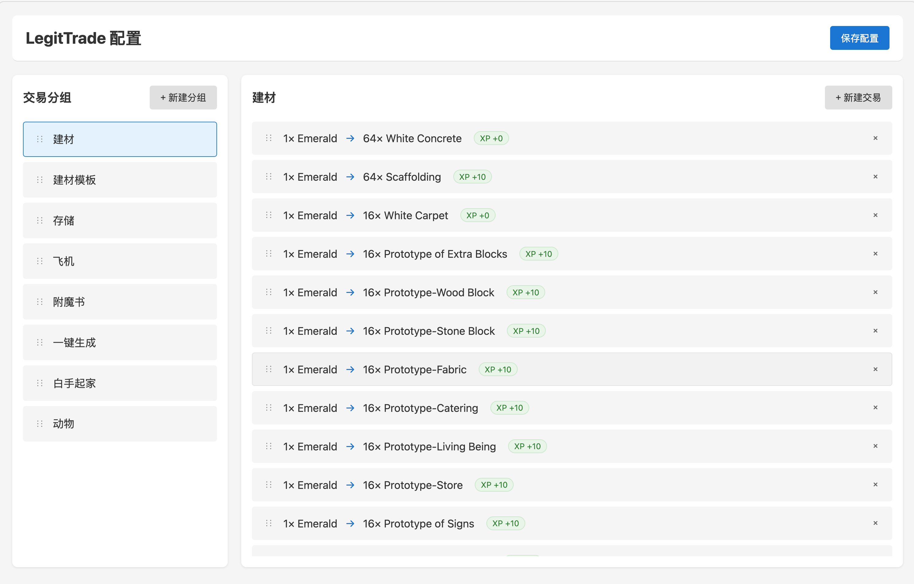
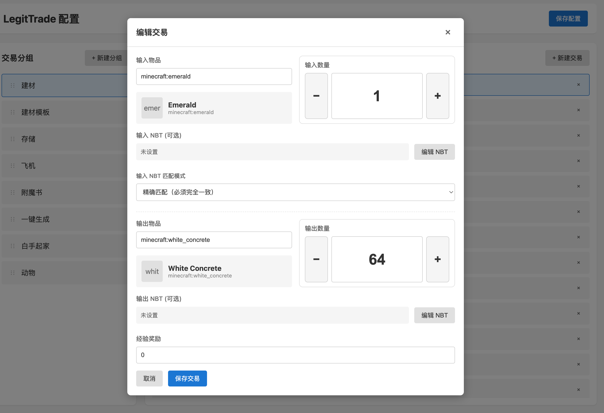
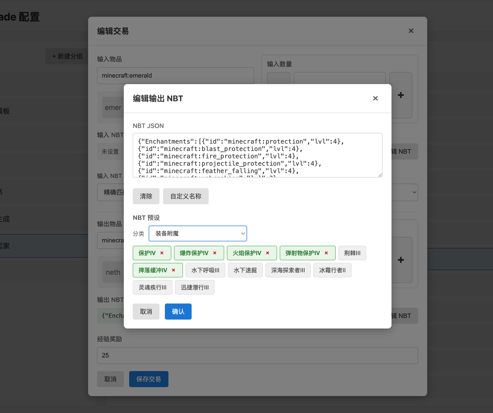

# LegitTrade 1.0.2 - 服务器交易系统

## 开发故事

最开始，我用 **Simple Villager** 把村民抓起来，方便交易。

后来换成 **Custom Villager Trade**，自定义交易内容。

然后我想：**为什么还要依赖村民？**

我不想和村民斗智斗勇——把他们运到正确位置、绑定工作方块、防止被僵尸感染、重新刷想要的交易……太麻烦了。

我想要的很简单：

> **一个看起来像生存的创造模式**——在物品获取方面。

- 不想增加游戏难度，只想让获取东西更方便
- 不想和村民打交道，只想点一下就拿到东西
- 某些方面比创造模式更强——轻松自定义 NBT，获得锋利 10 的下界合金剑、击退 10 的弓，超越原版强度
- 甚至还可以一次交易给自己奖励1000点经验值

于是有了 LegitTrade——合法交易，完全合法。难道我不是在生存模式下获得这些物品吗？

**右键方块，点击，完成。彻底摆脱村民。**

## 核心便利性

### 🎮 游戏内即开即用

- **低廉的成本**：9个任意原木，即可合成一个交易方块
- **零学习成本**：右键 `trade_block` 打开界面，左侧选交易，右侧点输出，完成
- **自动填充**：选中交易后，系统自动从背包提取所需物品，无需手动拖拽
- **批量交易**：Shift+点击输出槽，连续执行直到背包满或材料耗尽
- **实时预览**：输入槽变化时，输出预览自动刷新
- **强大MOD兼容**：只要是游戏中存在的物品，都可以在WEB界面搜索到，配置到你的交易中去

### 🌐 Web 管理面板

**浏览器直接管理交易配置，无需重启服务器**

访问 `http://服务器IP:39482`：

- 可视化添加/编辑/删除交易
- 物品 ID 搜索提示
- NBT 编辑器（附魔、耐久等）
- 保存后自动同步给所有在线玩家







### ⚡ 服务端无忧运行

- **热重载**：`/tradereload` 重载配置，无需重启服务器
- **自动同步**：玩家加入时自动获取最新交易配置
- **安全可靠**：交易逻辑全部在服务端执行，防作弊

## 典型使用场景

| 场景 | 传统方式 | LegitTrade |
|------|---------|------------|
| 兑换活动奖励 | 记指令 `/exchange xxx`，玩家常输错 | 右键方块，点一下 |
| 服务器货币兑换 | 找 NPC，对话，选选项 | 右键方块，点一下 |
| 材料回收 | 多个指令组合 | 右键方块，点一下 |
| 修改交易配置 | 改配置文件，重启服务器 | Web 界面改，自动生效 |

## 配置示例

```json
[
  {
    "group": "新手礼包",
    "trades": [
      {
        "input": "minecraft:dirt",
        "output": "minecraft:diamond",
        "inputCount": 64,
        "outputCount": 1,
        "xpReward": 100
      }
    ]
  }
]
```

## 下载与安装

- **支持版本**：Minecraft 1.20.1 + Fabric
- **安装**：将 jar 文件放入 `mods` 文件夹
- **依赖**：Fabric API

## 技术信息

| 项目 | 版本 |
|------|------|
| Minecraft | 1.20.1 |
| Fabric Loader | 0.14.23 |
| Fabric API | 0.90.4+1.20.1 |
| Java | 17 |

## 许可证

MIT
